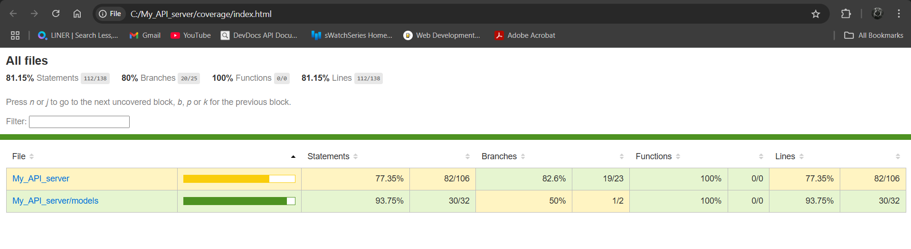

# My_API_server

## Overview

This project is a Node.js RESTful API server for managing products, built with Express and MongoDB (using Mongoose).

---

## APIs and Functionality

### Endpoints

- `GET /`  
  Returns a welcome message.

- `GET /blog`  
  Returns a simple introduction message.

- `GET /products`  
  Retrieves all products from the database.
- `GET /products/:id`  
  Retrieves a single product by its ID.

- `POST /products`  
  Creates a new product. Expects a JSON body with product details.

- `PUT /products/:id`  
  Updates an existing product by its ID. Expects a JSON body with updated fields.

- `DELETE /products/:id`  
  Deletes a product by its ID.

### Product Model

A product has the following fields:

- `name` (String, required)
- `quantity` (Number, required, default: 0)
- `price` (Number, required)
- `image` (String, optional)
- `createdAt`, `updatedAt` (timestamps)

---

## Tech Stack

- **Node.js** (JavaScript runtime)
- **Express** (Web framework)
- **MongoDB** (Database)
- **Mongoose** (ODM for MongoDB)
- **Vitest** (Testing framework)
- **Supertest** (API testing)

---

## Database

- **Type:** MongoDB (Cloud, via MongoDB Atlas)
- **Integration:** Uses Mongoose ODM for schema and data operations.
- **Connection String:** Set in `server.js` (replace with your own credentials for production).

---

## How to Run the Server

1. **Install dependencies:**
   ```bash
   npm install
   ```
2. **Start the server:**
   - For production:
     ```bash
     npm run serve
     ```
   - For development (with auto-reload):
     ```bash
     npm run dev
     ```
3. The server will run on [http://localhost:3000](http://localhost:3000)

---

## How to Run the Tests

- **Run all tests and generate coverage:**
  ```bash
  npx vitest run --coverage
  ```
- **View coverage report:**
  Open `coverage/index.html` in your browser for a detailed report.

---

## Testing Frameworks/Tools Used

- **[Vitest](https://vitest.dev/):** Main testing framework (unit, integration, API tests)
- **[Supertest](https://github.com/ladjs/supertest):** For HTTP assertions in API/integration tests

---

## Test Coverage

Below is a screenshot of the test coverage achieved (open `coverage/index.html` for details):



---

## How to Interact with the API

You can use tools like [Postman](https://www.postman.com/) or `curl` to interact with the API.

### Sample Requests

- **Create a Product**

  ```bash
  curl -X POST http://localhost:3000/products \
    -H "Content-Type: application/json" \
    -d '{"name": "Sample Product", "quantity": 10, "price": 99.99, "image": "http://example.com/image.jpg"}'
  ```

- **Get All Products**

  ```bash
  curl http://localhost:3000/products
  ```

- **Get a Product by ID**

  ```bash
  curl http://localhost:3000/products/<product_id>
  ```

- **Update a Product**

  ```bash
  curl -X PUT http://localhost:3000/products/<product_id> \
    -H "Content-Type: application/json" \
    -d '{"name": "Updated Product", "quantity": 5, "price": 49.99}'
  ```

- **Delete a Product**
  ```bash
  curl -X DELETE http://localhost:3000/products/<product_id>
  ```

---

## Keploy API Testing Dashboard Report

Below is a screenshot of the test reports from the Keploy API Testing Dashboard:


You can view the CI/CD configuration file here: [.github/workflows/keploy-api-test.yml](https://github.com/Diptesh-Bal/My_API_server/blob/main/.github/workflows/keploy-api-test.yml)

---

## Notes

- Make sure to update the MongoDB connection string in `server.js` with your own credentials for production use.
- The API uses JSON for request and response bodies.
